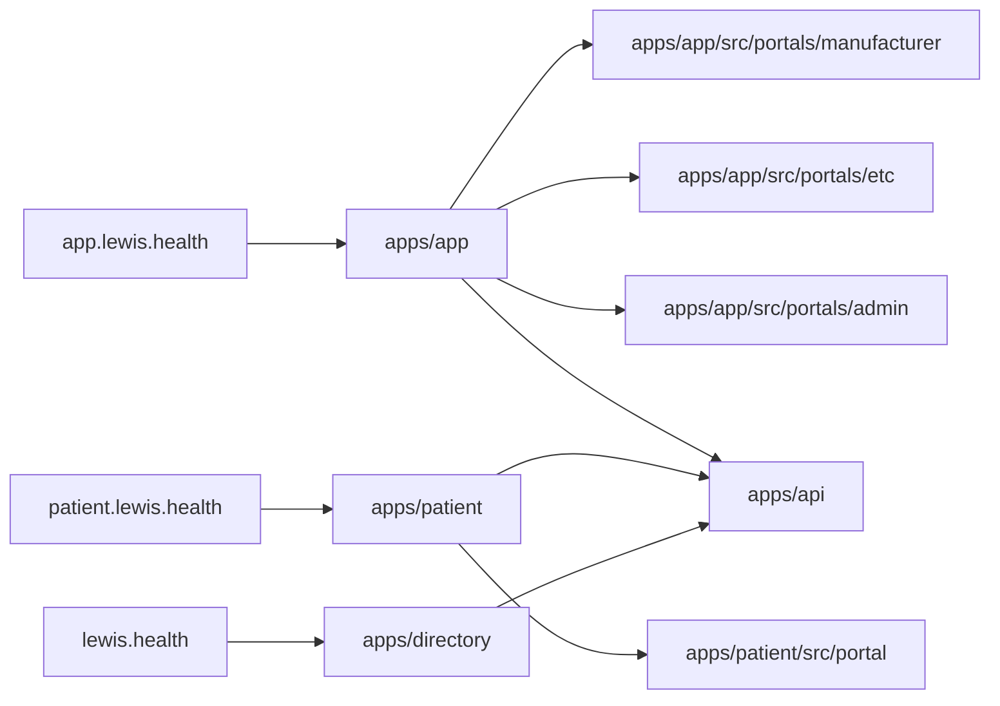

# Lewis

Operating platform for Montana's Experimental Treatment Center (ETC) regime under SB 535 + MAR 2026-427.1. Serves biotech manufacturers, ETCs, patients, boards, Lewis internal users, and anonymous public-directory visitors over one RLS'd data layer. See [b2bprd.md](docs/b2bprd.md) for the regulated operating platform spec and [directoryprd.md](docs/directoryprd.md) for the public directory spec — **every feature must trace to a section of SB 535, a RULE in MAR 2026-427.1, or the applicable directory PRD section**.

## Architecture

- `lewis.health` — anonymous public directory (Vite/React, SEO-critical, no PHI)
- `app.lewis.health` — manufacturer + ETC + internal admin portal (Vite/React)
- `patient.lewis.health` — patient portal (Vite/React, mobile-first)
- API — Node + Hono, Dockerized on Railway (also renders the public program brief PDF synchronously via Puppeteer + apt-installed Chromium per slice 3 — see Gotchas)
- Workers — BullMQ on Redis, Dockerized on Railway
- Data — Supabase Postgres 15+ with RLS; Supabase Storage (HIPAA-eligible bucket)
- Auth — Clerk authenticates identity; Lewis tenant memberships and relationships live in Postgres. The API sets transaction-local `app.*` variables for RLS. The directory is anonymous-first and never imports Clerk at the route level.

Frontend deployment boundaries are intentionally asymmetric across three independently-deployed apps:



`apps/app` is the authenticated staff/business console for biotech manufacturer, ETC, and Lewis internal admin workflows. `apps/patient` is a separate patient-facing product because it has different auth posture, UX, PHI exposure, analytics/logging constraints, accessibility review, bundle, and release risk. `apps/directory` is a third anonymous-first public product served at `lewis.health` — only `/v1/public/*` API endpoints, Clerk lazy-loaded only inside the connect-request flow, 120 KB above-the-fold JS budget.

Monorepo layout: `apps/app`, `apps/patient`, `apps/directory` (anonymous public directory), `apps/api`, `apps/workers`, `packages/shared` (zod schemas, types), `packages/db` (migrations, RLS policies), `packages/ui` (design tokens + shared components), `packages/notifications`, `packages/pdf`, `packages/rbac`, plus `packages/gate` (TEMPORARY — Vercel Edge Middleware password gate in front of all three frontends; deleted before public launch per the cleanup sequence in [packages/gate/README.md](packages/gate/README.md)).

## Stack (reference)

React 18 · TypeScript · Vite · Tailwind · shadcn/ui · React Router · TanStack Query · react-hook-form + zod · Hono · BullMQ + Redis · Supabase · Puppeteer · Resend · Stripe · Plaid · Clerk · Sentry · react-intl.

## Commands

Toolchain and tasks are managed by [mise](https://mise.jdx.dev). After clone, `mise install` provisions Node 20 and pnpm 9 per [mise.toml](mise.toml). Postgres is intentionally NOT installed by mise (the postgres plugin compiles from source and broke every CI workflow on the first try). Local devs run Postgres + Redis via Docker Compose (`mise run db:up`); CI uses a Postgres service container per workflow. If you need `psql` locally for ad-hoc queries: `brew install libpq` (macOS) or `docker exec -it lewis-postgres psql -U lewis lewis_dev`. Run `mise tasks` to list everything.

```
mise install              # provision pinned toolchain
mise run install          # pnpm install workspace deps

mise run dev              # Docker infra + API + workers + all three frontends
mise run dev:infra        # Docker Postgres + Redis
mise run dev:all          # API + workers + all three frontends, without starting Docker
mise run dev:app          # staff/business console: manufacturer + ETC + admin
mise run dev:patient      # patient portal
mise run dev:directory    # public directory (lewis.health)
mise run dev:api          # Hono API
mise run dev:workers      # BullMQ workers

mise run typecheck        # tsc --noEmit — run after every series of edits
mise run lint
mise run lint:fix
mise run format
mise run format:check

mise run test             # vitest unit + integration
mise run test:watch
mise run test:e2e         # playwright
mise run test:a11y        # axe-core — required for patient portal changes

mise run build            # production builds (depends on typecheck)

mise run db:up            # start local Docker Postgres
mise run db:down          # stop local Docker Postgres
mise run db:reset         # wipe Docker volumes + re-migrate + seed
mise run db:migrate
mise run db:generate      # migration from schema diff
mise run db:rls:test      # semantic SQL RLS suite — required for any new PHI table
mise run db:seed          # NEVER against staging or prod

mise run ci               # full pre-merge gate (matches CI exactly)

mise run down             # stop Docker infra and local dev servers
```

**Before committing:** `mise run ci`. It chains typecheck, lint, format:check, test, and test:a11y.

**Prefer single test runs** during iteration: `pnpm --filter <pkg> test <file>` or `-t "<name>"`. The full `mise run test` sweep is for the pre-commit gate.

**Adding a task:** put it in [mise.toml](mise.toml), not as a one-off shell snippet here. Use `depends = [...]` so the task graph stays explicit.

## Code style

- TypeScript strict mode everywhere. No `any` — use `unknown` + narrow, or define the type.
- ES modules only (`import`/`export`), no CommonJS.
- Validate every external input with zod (API requests, webhooks, env vars, form data). Shared schemas live in `packages/shared`.
- Prefer server state via TanStack Query. No manual `useEffect` fetch patterns.
- Forms: `react-hook-form` + zod resolver. No uncontrolled manual validation.
- All strings externalized through `react-intl` from day one, even though MVP 1 is English-only.
- Dates: store UTC, display in `America/Denver` for deadline-bearing surfaces (AE 5-day clock, Jan 31 annual report, Feb 1 HFAR). Use `date-fns-tz`.
- Money: integer cents, never floats. USD only in MVP 1.
- File naming: `kebab-case.ts` for modules, `PascalCase.tsx` for components, `use-foo.ts` for hooks.
- Tailwind classes sorted via `prettier-plugin-tailwindcss`. No inline styles except for dynamic values.

## Security and HIPAA — YOU MUST follow these

PHI is in scope from day one. Lewis is a Business Associate.

1. **RLS is the tenant-isolation mechanism.** Every PHI-bearing table must have an RLS policy keyed off transaction-local application context (`app.user_id`, `app.active_tenant_id`, `app.role`, `app.request_id`, optional `app.support_ticket_id`) set by the Hono API after Clerk verification. App runtimes connect as non-owner `app_api`/`app_worker` roles with `NOBYPASSRLS`; migrations and seed use `MIGRATION_DATABASE_URL`. IMPORTANT: never write a user-facing code path that uses a Supabase service-role, table owner, or admin database role to bypass tenant RLS. Any new RLS table must have `FORCE ROW LEVEL SECURITY`, policy coverage, and a matching semantic SQL test in `db:rls:test`.
2. **Audit log is append-only.** Every state change writes to `audit_log` (tenant, actor, action, target, before, after, ip, ua, ts). A Postgres trigger blocks UPDATE/DELETE on `audit_log`. Do not add code paths that skip the audit write.
3. **No PHI in logs, Sentry breadcrumbs, analytics events, error messages, or URLs.** PostHog events go through a redaction layer; patient identifiers are tokenized. API and worker runtime code must use the structured pino logger with redaction; `console.*` is banned outside scripts by ESLint/CI. If you need to log for debugging, use the tenant + object ID only.
4. **No PHI to unapproved subprocessors.** The approved list is in [b2bprd.md § 17.9](docs/b2bprd.md). Adding a new third-party dependency that will see PHI requires a BAA before it reaches staging, let alone prod.
5. **File uploads go to the HIPAA-eligible Supabase bucket** with SHA-256 on write. Regulated objects (patient agreements, informed consent recordings, ETRB approvals, AE reports) are immutable — replacement creates a new version, never overwrites.
6. **Retention locks are enforced in the database**, not application code: patient files 5 years post-discharge (RULE 12(4)), ETRB records 5 years (RULE 16(6)(d)), QAPI minutes 3 years (RULE 15(5)), audit log 7 years. Do not add delete paths that bypass retention.
7. **TLS 1.3 only.** Clerk MFA is required for manufacturer and ETC users. Break-glass admin access requires a ticket reference and is audit-logged.
8. **Secrets management:** local + CI secrets go through [fnox.toml](fnox.toml) (age-encrypted in-repo, recipient-gated by profile: `api_dev`, `workers_dev`, `workers_elevated_dev`, `frontend_app_dev`, `frontend_patient_dev`, `ci`). Each app's package.json `dev` script wraps in `fnox run -P <profile> -- <cmd>` so secrets land in env at startup. `SUPABASE_SERVICE_ROLE_KEY` is allowed only in `workers_elevated_dev`; it must never be present in `api_dev`, `workers_dev`, frontend, or `ci` profiles. **Production and staging secrets live in Vercel/Railway env vars only — never in fnox, never in the repo, never in CLAUDE.md, never in test fixtures.** Onboarding a dev: generate an age key, hand the pubkey to an existing recipient, who appends it to the `recipients` array under `[providers.age]` and runs `fnox reencrypt`. Revocation: remove the pubkey, re-encrypt, rotate values that the revoked party held. Plaintext `.env*` is gitignored — prefer fnox for anything beyond well-known local defaults.

## Product principles (resolve trade-offs with these)

1. Compliance is a feature, not a chore — regulatory artifacts are first-class objects with version history and one-click export.
2. **The rules are the spec** — every feature traces to SB 535 or a RULE. If it doesn't, it doesn't ship.
3. **Patient dignity is non-negotiable** — the patient portal never uses gamification, urgency tactics, growth-hacking patterns, or marketing copy. Plain, honest, calm.
4. Audit-ready by default.
5. Multi-tenant from line one.
6. Boring tech, careful integrations — do not introduce a new dependency to solve what Stripe/Plaid/Clerk/Resend/Sentry already solve.

## Testing

- Unit tests for business logic colocated as `*.test.ts`.
- Integration tests for API handlers hit real local Docker Postgres. Do not mock the database.
- RLS policies are tested via the semantic SQL suite in `packages/db/test/rls` — a new RLS policy without a test is not complete.
- E2E tests cover the full patient intake flow (Stage 1 → Stage 8 in [b2bprd.md § 10.5](docs/b2bprd.md)), AE 5-day workflow, and ETRB protocol review.
- A11y: patient portal targets WCAG 2.1 AA. `pnpm test:a11y` gates patient-portal PRs.

## Git and repo etiquette

- **Branching flow:** `main` is production, `staging` is the integration branch. Work happens locally, then in feature branches cut **off `staging`** (not `main`). Feature branch → PR into `staging` → after validation in staging, `staging` is promoted to `main` via a separate PR. Never cut a feature branch off `main`, never PR a feature branch directly into `main`, never commit directly to either long-lived branch.
- **Skill-base override:** When any skill (`/review`, `/ship`, `/land-and-deploy`, etc.) needs to detect "the base branch" for diffs, PRs, or review scope, it MUST use `staging` — NOT `main`, NOT GitHub's auto-detected default branch. Apply this to every `git diff`, `git fetch`, `git log`, and `gh pr create` invocation. Do not ask; this is the project default. The only exception is the staging→main promotion PR, which is created with `--base main` deliberately.
- Branches: `feat/<short-desc>`, `fix/<short-desc>`, `chore/<short-desc>`.
- Conventional Commits: `feat:`, `fix:`, `chore:`, `refactor:`, `docs:`, `test:`.
- IMPORTANT: never add `Co-Authored-By: Claude` trailers, `🤖 Generated with Claude Code` footers, or any AI attribution to commits or PRs. Write in first-person imperative as the user.
- PRs must reference the PRD section and (where applicable) the SB 535 § or RULE the change implements.
- Do not commit generated PDFs, recordings, or any file that could contain PHI.
- Never force-push to `main` or `staging`. Never bypass hooks with `--no-verify`.

## Gotchas

- API requests must resolve an active Lewis tenant through the narrow `app.resolve_authenticated_membership(...)` bootstrap helper before setting transaction-local RLS context; missing or invalid tenant context is a 401/403, never a silent service-role fallback.
- Stripe and Plaid webhooks require signature verification before any state change — a missing/invalid signature is a 400 with no DB write.
- Montana deadlines (`Jan 31`, `Feb 1`, 5-day AE clock) are `America/Denver`, not UTC. Off-by-a-day here is a compliance miss.
- Provisional ETC status gate: an ETC without an associated ETRB with RULE 16(6)(f) determinations cannot enroll patients into treatment. Enforce in both API and UI.
- H&P older than 12 months blocks treatment (RULE 12(2)(b)(iii)). Validate at treatment-schedule time, not just upload time.
- Puppeteer PDF rendering for **regulated artifacts** (patient agreements, informed-consent recordings, ETRB approvals, AE reports — see [b2bprd.md § 17.5](docs/b2bprd.md)) runs asynchronously in a BullMQ worker, never on the API request path. **Public catalog artifacts** (`/v1/public/programs/:slug/brief.pdf`) render synchronously inside the API process with a 5s hard timeout, a tighter 30/min/IP rate-limit bucket, and a Cloudflare 1h max-age + 24h SWR edge cache — these carry no PHI and follow [directoryprd.md § 15.6](docs/directoryprd.md#L1121) + § 28.4. Don't move public brief.pdf to the worker queue; don't move regulated artifacts onto the request path.
- Running any `dev:*` task without an age private key whose public key is in `fnox.toml` `[providers.age].recipients` will fail at decryption. Get added as a recipient first.
- Adding a new SQL migration to `packages/db/migrations/` requires regenerating the journal: `pnpm --filter @lewis/db migrate:journal` then commit `migrations/meta/_journal.json`. CI gate `migrate:journal:check` fails the PR if the disk journal drifts from the regenerated output. Without this, `drizzle-kit migrate` (the production migration runner in `deploy-staging.yml` / `deploy-prod.yml`) silently skips the new file.
- `MIGRATION_DATABASE_URL` is the schema-owner DSN and lives ONLY on the GitHub Actions runner (env-scoped GH Secrets `STAGING_MIGRATION_DATABASE_URL` / `PROD_MIGRATION_DATABASE_URL`). Never on a Railway service env per security #1. The runtime `app_api` / `app_worker` DSNs cannot apply migrations (NOBYPASSRLS, no schema-modify rights).

## References

- [b2bprd.md](docs/b2bprd.md) — regulated operating platform PRD. The compliance mapping in § 19 is the authoritative feature-to-rule trace.
- [directoryprd.md](docs/directoryprd.md) — anonymous public directory PRD for `lewis.health`.
- SB 535 (69th Montana Legislature, 2025).
- MAR Notice 2026-427.1 (April 10, 2026).

## Evolving this file

Treat CLAUDE.md like code. Add an entry when Claude makes the same mistake twice, a code review catches something structural, or a correction is repeated. Delete entries Claude already follows unprompted. Keep it under ~200 lines — bloat degrades adherence. Large scoped rule sets go in `.claude/rules/<topic>.md` with path-scoped frontmatter, not inline here.
