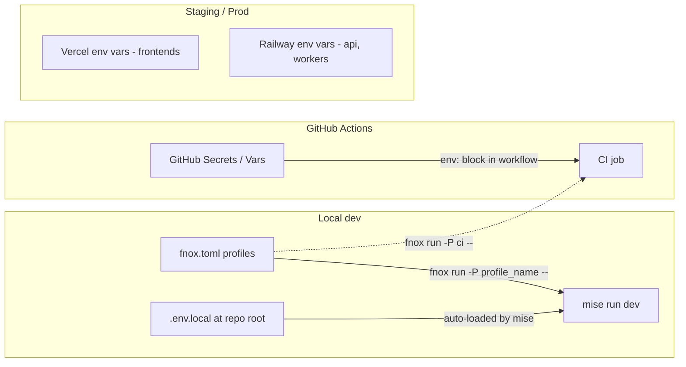

# Corridor Environment Variables — End-to-End Tracker

The single source of truth for every environment variable across Corridor. Use this to:

- Know **which** runtime needs **which** var
- Track **when** in the sprint plan you need to obtain each provider account
- Track **status** of each var (declared vs. filled vs. live)
- Identify gaps between code and config

If you add a new env var anywhere in the codebase, you must update this file in the same PR.

> Related: [docs/implementation.md](./implementation.md) (sprint plan), [fnox.toml](../fnox.toml) (encrypted secret store), [env/](../env/) (templates), [docs/runbooks/developer-onboarding.md](./runbooks/developer-onboarding.md) (new-dev onboarding).

---

## Table of contents

1. [TL;DR — current status](#tldr--current-status)
2. [How env loading actually works](#how-env-loading-actually-works)
3. [Where each kind of value lives](#where-each-kind-of-value-lives)
4. [Gaps to fix right now (5 items)](#gaps-to-fix-right-now-5-items)
5. [Complete end-to-end env var matrix](#complete-end-to-end-env-var-matrix)
   - [Backend secrets (server-only, from fnox)](#backend-secrets-server-only-from-fnox)
   - [Browser-exposed (Vite, from fnox frontend profiles)](#browser-exposed-vite-from-fnox-frontend-profiles)
   - [Database / Redis](#database--redis)
   - [Local infra / runtime defaults (`.env.local`)](#local-infra--runtime-defaults-envlocal-only)
   - [Behavior toggles (local/test)](#behavior-toggles-mostly-localtest)
   - [CI-only (GitHub Secrets / Vars, not fnox)](#ci-only-github-secrets--vars-not-fnox)
   - [Sprint 6+ (deferred)](#sprint-6-defer-not-needed-yet)
6. [Sprint timing — when each var actually needs a value](#sprint-timing--when-each-var-actually-needs-a-value)
7. [Recommended action plan](#recommended-action-plan-sequenced)
8. [Operational notes](#operational-notes)

---

## TL;DR — current status

- **Foundation merged** (Sprint 1 complete on `main`). Local dev boots without any provider secrets — fnox is configured with `if_missing = "warn"`.
- **Architecture is sound**: 6 fnox profiles (`api_dev`, `workers_dev`, `workers_elevated_dev`, `frontend_app_dev`, `frontend_patient_dev`, `ci`). `SUPABASE_SERVICE_ROLE_KEY` is hard-isolated to `workers_elevated_dev`. CI gates enforce the boundary.
- **Five code-vs-config gaps identified** (see [§ 4](#gaps-to-fix-right-now-5-items)). All are docs/template hygiene — no runtime risk, but a teammate cloning fresh has no signal these vars exist.
- **Sprint 2 starting soon** → only Clerk + Supabase keys need real values now. Everything else is sprint-gated; defer obtaining provider accounts until that sprint.

---

## How env loading actually works

| Source | What lives there | Loaded by |
|---|---|---|
| `.env.local` (root, gitignored) | Non-secret local defaults: DB URLs, ports, log level, CORS, Vite public vars | mise (`mise.toml` `_.file`) |
| `fnox.toml` (committed, age-encrypted values) | Provider secrets per profile | `fnox run -P <profile> -- <cmd>` in each app's `pnpm dev` |
| `env/.env.<app>.example` (committed) | **Reference checklists** — never loaded at runtime | n/a (documentation only) |
| GitHub Secrets | CI provider keys, deploy hook URLs | `${{ secrets.X }}` in workflows |
| GitHub Vars | CI deploy target URLs | `${{ vars.X }}` in workflows |
| Vercel env vars | Frontend prod/staging values | Vercel build + runtime |
| Railway env vars | API + workers prod/staging values | Railway runtime |

> **Hard rule:** plaintext `.env*` files are gitignored entirely. Never check in real secrets. Never put production values in fnox — production lives in Vercel/Railway only.

---

## Where each kind of value lives

| Var family | Local dev | CI | Staging | Production |
|---|---|---|---|---|
| Non-secret runtime defaults (`NODE_ENV`, `TZ`, `LOG_LEVEL`, `PORT`, ports) | `.env.local` | `env:` block in workflow | Railway / Vercel | Railway / Vercel |
| DB / Redis URLs | `.env.local` | `env:` block in workflow | Railway env | Railway env |
| Backend provider secrets | `fnox -P api_dev` / `workers_dev` / `workers_elevated_dev` | `fnox -P ci` | Railway env | Railway env |
| Vite public keys | `fnox -P frontend_app_dev` / `frontend_patient_dev` | `fnox -P ci` | Vercel env | Vercel env |
| CI-only (deploy hooks, e2e URLs) | n/a | GitHub Secrets / Vars | n/a | n/a |

---

## Gaps to fix right now (5 items) — ✅ RESOLVED 2026-04-25

Env vars that were referenced in source but not declared in any template or fnox profile. All five are now documented. Decisions captured below.

| Status | Var | Used in | What it does | Resolution |
|---|---|---|---|---|
| ✅ | `WORKER_ELEVATED` | [apps/workers/src/index.ts:114,120](../apps/workers/src/index.ts#L114-L120) | `true` → workers expect privileged DB role (workers-elevated process); else `app_worker` | Documented (commented) in `env/.env.workers.example`; **set to `true`** (uncommented, required) in `env/.env.workers-elevated.example` |
| ✅ | `WORKER_RUNTIME_ROLE_OPT_OUT` | [apps/workers/src/index.ts:107](../apps/workers/src/index.ts#L107) | Test-only: skip RLS-bound role assertion | Documented in `env/.env.workers.example` with `NEVER set in staging/prod` warning |
| ✅ | `API_RUNTIME_ROLE_OPT_OUT` | [apps/api/src/index.ts:23](../apps/api/src/index.ts#L23) | Test-only: skip RLS-bound role assertion | Documented in `env/.env.api.example` with `NEVER set in staging/prod` warning |
| ✅ | `CORRIDOR_SEED_ALLOW_NON_LOCAL` | [packages/db/scripts/seed-dev.ts:9](../packages/db/scripts/seed-dev.ts#L9) | Deliberate trap — always errors when set | Trap explanation added to `env/.env.local.example` |
| ✅ | `RESEND_WEBHOOK_SECRET` | `env/.env.api.example` + Sprint 4 use | Resend delivery webhook signature | **Decision:** keep. Restored to `api_dev` fnox profile in `fnox.toml` so template ↔ fnox stay aligned. Empty until Sprint 4 wires Resend. |

---

## Complete end-to-end env var matrix

**Legend:**

- **R** = required for that runtime to boot
- **F** = feature-gated (unset → feature degrades gracefully)
- **CI** = required in CI only
- **—** = not used by this runtime
- **❌ never** = explicitly forbidden in this runtime (tier-2 secret hard-isolation)

### Backend secrets (server-only, from fnox)

| Status | Variable | api | workers | workers-elev | CI | Sensitivity | Sprint | Purpose |
|---|---|---|---|---|---|---|---|---|
| ☐ | `CLERK_SECRET_KEY` | R | R | — | R | secret | 1 | Clerk JWT verification, user lookup |
| ☐ | `CLERK_WEBHOOK_SECRET` | R | — | — | R | secret | 1 | Clerk org/user webhook signature |
| ☐ | `CLERK_JWT_AUDIENCE` | F | — | — | — | secret | 1 | Optional audience pin |
| ☐ | `CLERK_AUTHORIZED_PARTIES` | F | — | — | — | secret | 1 | Optional CSRF posture |
| ☐ | `STRIPE_SECRET_KEY` | R | R | — | R | secret | 5 | Stripe API |
| ☐ | `STRIPE_WEBHOOK_SECRET` | R | — | — | R | secret | 5 | Stripe webhook signature |
| ☐ | `PLAID_CLIENT_ID` | R | — | — | — | secret | 5 | Plaid client identifier |
| ☐ | `PLAID_SECRET` | R | — | — | R | secret | 5 | Plaid API key |
| ☐ | `PLAID_ENV` | R | — | — | — | public | 5 | `sandbox` / `production` |
| ☐ | `PLAID_WEBHOOK_SECRET` | R | — | — | — | secret | 5 | Plaid webhook signature |
| ☐ | `RESEND_API_KEY` | R | R | — | R | secret | 4 | Transactional email |
| ☐ | `RESEND_WEBHOOK_SECRET` | R | — | — | — | secret | 4 | Resend delivery webhook (see [gaps](#gaps-to-fix-right-now-5-items)) |
| ☐ | `SENTRY_DSN` | R | R | R | R | secret | 1 | Backend error tracking |
| ☐ | `SUPABASE_URL` | R | R | R | R | secret | 1 | Supabase project endpoint |
| ☐ | `SUPABASE_SERVICE_ROLE_KEY` | ❌ never | ❌ never | R | ❌ | secret-tier-2 | 4 | Storage signed-URL minting (HARD ISOLATION; CI gates this) |
| ☐ | `DAILY_API_KEY` | R | — | — | R | secret | 6 | Video/recording (Daily.co) |
| ☐ | `ESIGN_API_KEY` | R | — | — | R | secret | 5 | E-signature provider |

### Browser-exposed (Vite, from fnox frontend profiles)

> Only `VITE_`-prefixed vars reach the browser bundle (Vite convention). All values become public on deploy — never put server secrets here.

| Status | Variable | app | patient | CI | Sprint | Purpose |
|---|---|---|---|---|---|---|
| ☐ | `VITE_API_BASE_URL` | R | R | R | 1 | API client base URL |
| ☐ | `VITE_CLERK_PUBLISHABLE_KEY` | R | R | R | 1 | Clerk React SDK |
| ☐ | `VITE_STRIPE_PUBLISHABLE_KEY` | F | F | R | 5 | Stripe Elements / Plaid Link |
| ☐ | `VITE_SENTRY_DSN` | F | F | — | 1 | Frontend error tracking (separate DSN from backend) |

### Database / Redis

> Local: from `.env.local` (mise auto-loaded). Prod/staging: Railway env. CI: `env:` block at top of each workflow.

| Status | Variable | Where | Purpose |
|---|---|---|---|
| ☐ | `DATABASE_URL` | api, db migrations | RLS-bound `app_api` role |
| ☐ | `WORKER_DATABASE_URL` | workers | RLS-bound `app_worker` role |
| ☐ | `MIGRATION_DATABASE_URL` | migrations + seed only | DDL owner role |
| ☐ | `DB_HOST` / `DB_PORT` / `DB_DATABASE` / `DB_USERNAME` / `DB_PASSWORD` | api | Fallback when `DATABASE_URL` unset |
| ☐ | `WORKER_DB_HOST` / `WORKER_DB_PORT` / `WORKER_DB_DATABASE` / `WORKER_DB_USERNAME` / `WORKER_DB_PASSWORD` | workers | Fallback when `WORKER_DATABASE_URL` unset |
| ☐ | `MIGRATION_DB_HOST` / `MIGRATION_DB_PORT` / `MIGRATION_DB_DATABASE` / `MIGRATION_DB_USERNAME` / `MIGRATION_DB_PASSWORD` | migrations | Fallback when `MIGRATION_DATABASE_URL` unset |
| ☐ | `REDIS_URL` | api, workers, workers-elev | BullMQ + idempotency cache |
| ☐ | `REDIS_HOST` / `REDIS_PORT` | all | Fallback when `REDIS_URL` unset |

### Local infra / runtime defaults (`.env.local` only)

| Status | Variable | Default | Purpose |
|---|---|---|---|
| ☐ | `NODE_ENV` | `development` | Mode (also gates stub workers) |
| ☐ | `TZ` | `America/Denver` | Compliance deadline math (date-fns-tz). Required for Montana 5-day AE clock, Jan 31 / Feb 1 deadlines |
| ☐ | `LOG_LEVEL` | `debug` (local), `info` (prod) | pino verbosity |
| ☐ | `PORT` | `13001` | API listen port |
| ☐ | `LOCAL_POSTGRES_PORT` | `15432` | Docker Compose port mapping |
| ☐ | `LOCAL_REDIS_PORT` | `16379` | Docker Compose port mapping |
| ☐ | `CORS_ALLOWED_ORIGINS` | localhost ports | API CORS allowlist (boot fails if missing in non-test) |
| ☐ | `PUBLIC_API_BASE_URL` | `http://127.0.0.1:13001` | Self-link generation |

### Behavior toggles (mostly local/test)

| Status | Variable | Where | Purpose |
|---|---|---|---|
| ☐ | `ENABLE_STUB_WORKERS` | workers | Auto-true in dev/test; ignored in prod with warning |
| ☐ | `WORKER_ELEVATED` | workers, workers-elev | Selects expected DB role + RLS bypass posture |
| ☐ | `API_RUNTIME_ROLE_OPT_OUT` | api (TEST ONLY) | Skip role assertion in unit tests; **never set in staging/prod** |
| ☐ | `WORKER_RUNTIME_ROLE_OPT_OUT` | workers (TEST ONLY) | Skip role assertion in unit tests; **never set in staging/prod** |
| ☐ | `CORRIDOR_SEED_ALLOW_NON_LOCAL` | seed script | **Trap variable — always errors when set.** Documented to prevent confusion |

### CI-only (GitHub Secrets / Vars, not fnox)

> Set in repo settings → Secrets and variables → Actions. Not in fnox.

| Status | Variable | Type | Purpose |
|---|---|---|---|
| ☐ | `PROD_APP_DEPLOY_HOOK_URL` | secret | Vercel deploy trigger (app) |
| ☐ | `PROD_PATIENT_DEPLOY_HOOK_URL` | secret | Vercel deploy trigger (patient) |
| ☐ | `STAGING_APP_DEPLOY_HOOK_URL` | secret | Staging Vercel deploy trigger (app) |
| ☐ | `STAGING_PATIENT_DEPLOY_HOOK_URL` | secret | Staging Vercel deploy trigger (patient) |
| ☐ | `PHI_AUDIT_RETENTION_HOOK_URL` | secret | Nightly audit retention job trigger |
| ☐ | `PROD_APP_URL` | var | E2E target — staff/business app prod URL |
| ☐ | `PROD_PATIENT_URL` | var | E2E target — patient portal prod URL |
| ☐ | `PROD_API_ORIGIN_URL` | var | E2E target — API prod URL |
| ☐ | `STAGING_APP_URL` | var | E2E target — staff/business app staging URL |
| ☐ | `STAGING_PATIENT_URL` | var | E2E target — patient portal staging URL |
| ☐ | `STAGING_API_ORIGIN_URL` | var | E2E target — API staging URL |

### Sprint 6+ (defer; not needed yet)

> Do not add to fnox until you adopt these tools. The plan recommends in-house alternatives where feasible to avoid PHI exposure.

| Status | Variable | Sprint | Purpose |
|---|---|---|---|
| ☐ | `POSTHOG_API_KEY` | 6 | Analytics (recommend self-hosted for PHI posture) |
| ☐ | `POSTHOG_TEAM_KEY` | 6 | Alternative naming for PostHog |
| ☐ | `VANTA_API_KEY` | 6 | SOC 2 evidence collection (off-platform) |
| ☐ | `DRATA_API_KEY` | 6 | Alternative to Vanta |
| ☐ | `FEATURE_FLAG_PROVIDER` keys | 6 | LaunchDarkly **or** in-house (plan recommends in-house for tenant scoping) |

---

## Sprint timing — when each var actually needs a value

> "Now-required" means: feature work in that sprint is blocked without these. You can declare the var earlier in fnox/templates and leave it empty; you only need to **fill** it when the sprint that uses it begins.

| Sprint | What you must have set | Provider account needed | Status |
|---|---|---|---|
| **Sprint 1 — Foundation** ✅ done | DB / Redis / runtime defaults — already in `.env.local` | None (local Docker) | ☐ verify |
| **Sprint 2 — Auth + tenancy** | `CLERK_SECRET_KEY`, `CLERK_WEBHOOK_SECRET`, `VITE_CLERK_PUBLISHABLE_KEY`, `SUPABASE_URL` | Clerk dev account, Supabase project | ☐ |
| **Sprint 3 — Compliance/audit** | `SENTRY_DSN`, `VITE_SENTRY_DSN`, `PHI_AUDIT_RETENTION_HOOK_URL` | Sentry project | ☐ |
| **Sprint 4 — Notifications + storage** | `RESEND_API_KEY`, `RESEND_WEBHOOK_SECRET`, `SUPABASE_SERVICE_ROLE_KEY` (workers-elevated only) | Resend account; Supabase Storage HIPAA bucket | ☐ |
| **Sprint 5 — Payments + e-sign** | All `STRIPE_*`, all `PLAID_*`, `ESIGN_API_KEY` | Stripe + Plaid + e-sign vendor | ☐ |
| **Sprint 6 — Video + analytics** | `DAILY_API_KEY`, `POSTHOG_*`, feature-flag config | Daily.co + PostHog (self-hosted recommended) | ☐ |
| **Pre-staging deploy** | All Vercel/Railway env vars + `STAGING_*` GH secrets/vars | All providers above (test-mode keys) | ☐ |
| **Pre-prod deploy** | All Vercel/Railway prod env + `PROD_*` GH secrets/vars + `PHI_AUDIT_RETENTION_HOOK_URL` | All providers (live-mode keys); BAA signed for each subprocessor | ☐ |

---

## Recommended action plan (sequenced)

1. **Patch the 5 code-vs-config gaps** in env templates and `fnox.toml` (~15 min). Aligns documentation with reality before next sprint. See [§ 4](#gaps-to-fix-right-now-5-items).
2. **Decide on `RESEND_WEBHOOK_SECRET`** — keep in `api_dev` fnox profile or remove from template. Pick one and align.
3. **Add a top-of-file matrix** to [docs/runbooks/developer-onboarding.md](./runbooks/developer-onboarding.md) mirroring the [Sprint timing table](#sprint-timing--when-each-var-actually-needs-a-value) so a new dev knows exactly what they need to obtain when.
4. **Defer**: PostHog, Vanta, LaunchDarkly. Don't add to fnox until you actually adopt those tools.
5. **Production secrets**: don't touch yet. Vercel/Railway env vars happen at deploy time (Sprint 5+ for staging, after Sprint 6 for prod).

---

## Operational notes

### How to add a new env var (the rule)

1. Reference it from code (`process.env.X` for backend; `import.meta.env.VITE_X` for frontend).
2. Add it to the appropriate `env/.env.<runtime>.example` template.
3. If it's a secret, add it to the matching fnox profile in `fnox.toml` (`fnox set --profile <profile> <KEY> <value>` for the actual encrypted value).
4. If it's a non-secret default for local dev, add it to `env/.env.local.example` (and re-copy to `.env.local`).
5. **Update this document** in the same PR (matrix + sprint timing if applicable).
6. If it's CI-relevant: add to the `env:` block of the workflow OR to GitHub Secrets/Vars.
7. If it's prod-relevant: note it for the Vercel/Railway dashboards (don't put real prod values anywhere in repo).

### Sensitivity tiers

- **Tier 1 (standard secret):** Most provider keys. Live in fnox per-profile.
- **Tier 2 (privileged):** `SUPABASE_SERVICE_ROLE_KEY`. Hard-isolated to `workers_elevated_dev`. CI gates this via `mise run secrets:profiles:check`. Per [CLAUDE.md](../CLAUDE.md) security #1, no user-facing path may bypass RLS via service-role.
- **Public:** `VITE_*` vars (browser-exposed by design). Public publishable keys only.

### What to do when a teammate joins

1. Generate age key: `age-keygen -o ~/.config/corridor-age-maintainer.key`
2. Share pubkey with an existing recipient, who appends it to `[providers.age].recipients` in `fnox.toml` and runs `fnox reencrypt`.
3. Copy `env/.env.local.example` to `.env.local`.
4. `mise install && mise run install`.
5. `mise run dev` — boots locally even with empty fnox secrets (warnings only).
6. Sprint-by-sprint, fill in fnox values via `fnox set --profile <profile> <KEY> <value>`.

### What to do when a teammate leaves

1. Remove their pubkey from `[providers.age].recipients` in `fnox.toml`.
2. Run `fnox reencrypt`.
3. **Rotate every secret they had access to** (Clerk, Stripe, Resend, Supabase, etc.) — their local copy is still valid until rotation.

### Why not just one fnox profile?

- **Least privilege.** `frontend_app_dev` shouldn't be able to read `STRIPE_SECRET_KEY`. `api_dev` shouldn't be able to read `SUPABASE_SERVICE_ROLE_KEY`.
- **Per-runtime startup discipline.** Each app's `pnpm dev` script runs `fnox run -P <its profile> --` so missing secrets surface as warnings at boot for that runtime only.
- **HIPAA-relevant boundary.** Tier-2 isolation of `SUPABASE_SERVICE_ROLE_KEY` is enforced by both fnox profile membership and a CI gate.

### Why isn't `.env.local` per-app?

The architecture uses **fnox** for secrets per-runtime instead of per-app `.env.<app>` files. `.env.local` at root holds only non-secret defaults (DB URLs, ports, Vite public vars, CORS) that are shared across runtimes. The `env/.env.<app>.example` files are documentation of each fnox profile's surface — they're not loaded at runtime.

---

## Source code references — who reads what

This is the authoritative read-side of the matrix. If a var below isn't in [§ 5](#complete-end-to-end-env-var-matrix), the matrix is wrong and must be updated.

| Variable | Read at |
|---|---|
| `CLERK_SECRET_KEY`, `CLERK_JWT_AUDIENCE`, `CLERK_AUTHORIZED_PARTIES` | [apps/api/src/middleware/auth.ts](../apps/api/src/middleware/auth.ts) |
| `STRIPE_SECRET_KEY` | [apps/api/src/webhooks/stripe.ts](../apps/api/src/webhooks/stripe.ts) |
| `DATABASE_URL` and `DB_*` fallbacks | [packages/db/src/config.ts](../packages/db/src/config.ts) |
| `WORKER_DATABASE_URL` and `WORKER_DB_*` fallbacks | [apps/workers/src/database-env.ts](../apps/workers/src/database-env.ts) |
| `MIGRATION_DATABASE_URL` | [packages/db/src/config.ts](../packages/db/src/config.ts) |
| `REDIS_URL`, `REDIS_HOST`, `REDIS_PORT` | [packages/shared/src/redis-config.ts](../packages/shared/src/redis-config.ts) |
| `NODE_ENV`, `LOG_LEVEL` | [apps/api/src/logger.ts](../apps/api/src/logger.ts), [apps/workers/src/logger.ts](../apps/workers/src/logger.ts) |
| `PORT` | [apps/api/src/index.ts](../apps/api/src/index.ts) |
| `LOCAL_POSTGRES_PORT`, `LOCAL_REDIS_PORT` | [docker-compose.yml](../docker-compose.yml) |
| `ENABLE_STUB_WORKERS` | [apps/workers/src/index.ts](../apps/workers/src/index.ts) |
| `WORKER_ELEVATED` | [apps/workers/src/index.ts:114](../apps/workers/src/index.ts#L114) |
| `API_RUNTIME_ROLE_OPT_OUT` | [apps/api/src/index.ts:23](../apps/api/src/index.ts#L23) |
| `WORKER_RUNTIME_ROLE_OPT_OUT` | [apps/workers/src/index.ts:107](../apps/workers/src/index.ts#L107) |
| `CORRIDOR_SEED_ALLOW_NON_LOCAL` | [packages/db/scripts/seed-dev.ts:9](../packages/db/scripts/seed-dev.ts#L9) (trap) |
| `VITE_*` vars | `apps/app/src/main.tsx`, `apps/patient/src/main.tsx` (`import.meta.env.VITE_*`) |

---

## Maintenance

- **Last full audit:** 2026-04-25 (cross-referenced against `docs/implementation.md` v1.0, all source under `apps/`, `packages/`, `scripts/`, `.github/workflows/`, `fnox.toml`, `docker-compose.yml`, `mise.toml`).
- **Re-audit cadence:** After each sprint completion. Update the [TL;DR](#tldr--current-status) status row and the sprint timing checkboxes.
- **Owner:** whoever lands the env-touching change is responsible for updating this file in the same PR.

### Change log

- **2026-04-25** — Initial end-to-end audit. 5 code-vs-config gaps closed: `WORKER_ELEVATED`, `WORKER_RUNTIME_ROLE_OPT_OUT`, `API_RUNTIME_ROLE_OPT_OUT`, `CORRIDOR_SEED_ALLOW_NON_LOCAL` documented in templates; `RESEND_WEBHOOK_SECRET` restored to `api_dev` fnox profile.
